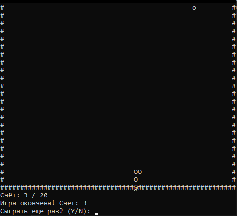

# snake

Работа предоставляет консольную реализацию классической игры **«Змейка»** на языке **C++**, разработанную в рамках тестового задания от ООО "НПО ПКРВ".  
Игра использует только стандартные библиотеки языка (std::) и единственную нестандартную – **windows.h** (для управления консолью и клавиатурным вводом).

---

## Принцип работы программы
Игрок управляет змейкой, которая движется по полю и ест **<o>**.  
После каждой съеденной еды змея увеличивается в длину, а игрок получает очки.  
Если змея сталкивается со стеной или сама с собой – игра завершается.  
Игрок побеждает, если набирает заданное количество очков.

---

## Управление
| Действие | Клавиша |
|----------|---------|
| Движение вверх | `W` или `↑` |
| Движение вниз | `S` или `↓` |
| Движение влево | `A` или `←` |
| Движение вправо | `D` или `→` |
| Выход из игры | `Esc` |

---

## Основные возможности
- Отрисовка поля, змейки и еды в реальном времени.
- Возможность задать:
  - скорость змейки (интервал обновления);
  - ширину и высоту игрового поля;
  - целевое количество очков для победы.
- Меню с возможностью перезапуска игры без закрытия консоли.

---

## Пример запуска
```
Введите скорость игры (50-1000, по умолчанию 150): 120
Введите ширину поля (10-120, по умолчанию 40): 60
Введите высоту поля (10-25, по умолчанию 20): 20
Введите целевое количество очков для победы (1-998, по умолчанию 10): 15
```
После старта появится игровое поле с рамкой, змеёй, едой и счетом. После окончания игры 
выведется её итог с вопросом о перезапуске.



---

## Логика игры
- Игровое поле представляет собой двумерную сетку, ограниченную стенами (`#`).
- Змейка хранится в векторе `vector<Point>`; её голова – первый элемент массива.
- На каждом шаге:
  1. Считывается состояние клавиш (`GetAsyncKeyState`);
  2. Змейка передвигается в выбранном направлении;
  3. Проверяются столкновения;
  4. Если змея съела еду — увеличивается длина и счёт.
- Конец игры наступает при:
  - столкновении головы со стеной;
  - столкновении головы с телом;
  - достижении целевого количества очков (победа).

---

## Используемые функции Windows API
| Функция | Назначение |
|----------|-------------|
| `SetConsoleCursorPosition` | Устанавливает курсор в нужную позицию |
| `SetConsoleCursorInfo` | Скрывает/показывает курсор |
| `FlushConsoleInputBuffer` | Очищает буфер клавиатуры после окончания игры |
| `GetAsyncKeyState` | Определяет, нажата ли клавиша в данный момент |
| `Sleep` | Задержка между обновлениями игры (скорость змейки) |

---

## Условия победы и поражения
| Событие | Результат |
|----------|------------|
| Столкновение со стеной | Поражение |
| Столкновение с собой | Поражение |
| Достижение цели (кол-во очков) | Победа |

---

## Дополнительно
 При повторном запуске игры начальное окно сбрасывается к исходным размерам.
- Игра поддерживает русский язык и кириллические символы.
- Код полностью соответствует требованию:  
- **используется только одна нестандартная библиотека – `windows.h`.**

---

## Автор
**Горелов Владислав Дмитриевич**
Октябрь 2025

---

